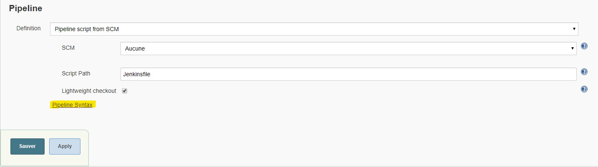
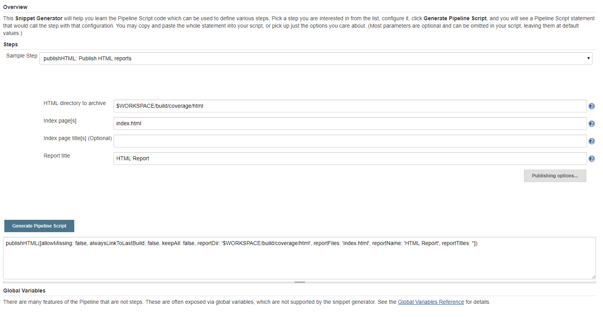

# Couverture de code C++ (GCC, CMake, Jenkins, Docker)

Ce projet à pour but de compiler un programme C++ avec mise en place d'un système de couverture de code.
Puis d'automatiser le processus via Docker et Jenkins.
Ce projet est réalisé sur un système Linux, et les outils utilisés ne sons pour la plupars pas disponible sous Windows.

## Outils utilisés

On utilise GCov afin de réaliser la couverture de code, il est combiné à d'autre outils afin de facilité sa mise en place et d'obtenir des inforamtions de couverture plus lisibles.

Voicie l'ordre dans lequel interviennent les diférents outils :
* CMake : ajout des options de compilation necessaires à la couverture de code
* GCC : compilation du programe, et génération des \*gcno, ces fichiers contiennent des informations pour reconstruire les basic block graphs et assigner les numéros de ligne du fichier source au block.
* Execution du programme : génére des fichiers \*.gcda, ces fichiers contiennent les arc transition counts et des sommaires d'informations.
* Gcov : utilise les fichiers \*.gcno et \*.gcda afin de produire des données de couverture de code.
* FCov/Gcovr : permet de convertire ces données dans divers formats (HTML, XML, Text).  
À noter que GCov est appellé automatiquement par FCov ou Gcovr.

## Options de compilation à activer

Pour mettre en place la couverture de code avec GCC il faut ajouter les options
de compilation suivantes, soit via CMake, soit dans le Makefile :
* -O0 : compilation sans optimisation
* -g : compilation en mode debug
* --coverage : active la couverture de code, cette option regroupe les trois suivantes :
    * -fprofile-arcs : chaque fichier compilé avec cette option générera un fichier de données \*.gcda à l'execution du programme.
    * -ftest-coverage : génère des \*.gcno (notes Gcvov) à partir des \*.gcda.
    * -lgcov : lie les fichiers générés à la librairie Gcov

## CMakeLists

Pour ce projet il y'a trois CMakeLists :
* Le premier à la racine du projet, noté /CMakeLists
* Le ssecond dans src, noté src/CMakeLists
* Le troisème dans tests, noté tests/CMakeLists

Il est préférable de les lire dans cet ordre pour en comprendre le fonctionnement.

**/CMakeLists**

On met en place le projet :
```CMake
cmake_minimum_required(VERSION 3.1...3.14)
project(crc
  VERSION 1.0
  DESCRIPTION "Code coverage test with CMake"
  LANGUAGES CXX)

set(CMAKE_CXX_STANDARD 14)
set(CMAKE_CXX_STANDARD_REQUIRED ON)
```

On créer une cible librairie de type INTERFACE, elle contiendra les tags de compilation relatives à la couverture de code :
```CMake
add_library(coverage_config INTERFACE)
```

On créer une option afin d'activer ou non la couverture de code :
```CMake
option(CODE_COVERAGE "Enable coverage reporting" OFF)
```

On verifie que l'on est bien sur un compilateur GCC, et on ajoute les tags de compilation nécessaires à la cible *coverage_config*
```CMake
if(CODE_COVERAGE AND CMAKE_CXX_COMPILER_ID MATCHES "GNU|Clang")
    message("Converture de code activée")
    target_compile_options(coverage_config INTERFACE
        -O0
        -g
        --coverage
    )
```

On fait en sorte qu'elle passe ces tags de compilation aux cibles avec lesquelles elle sera liées :
```CMake
    if(CMAKE_VERSION VERSION_GREATER_EQUAL 3.13)
        target_link_options(coverage_config INTERFACE --coverage)
    else()
        target_link_libraries(coverage_config INTERFACE --coverage)
    endif()
endif()
```

On ajoute les sous répertoire *src* et *tests* au projet
```CMake
add_subdirectory(src)
add_subdirectory(tests)
```

**/src/CMakeLists**

On ajoute une cible de type librarie
```CMake
add_library(processing processing.cpp)
```

On ajoute le dossier src à la cible, afin d'inclure les .h dans le Makefile généré par CMake, et d'éviter une erreur de compilation
```CMake
target_include_directories(processing PUBLIC ${CMAKE_CURRENT_SOURCE_DIR})
```

On lie processing est coverage_config, ainsi processing hérite des tags de compilation de celle-ci grace à target_link_options déffini au CMakeLists à la racine.
```CMake
target_link_libraries(processing PUBLIC coverage_config)
```

**/test/CMakeLists**

On ajoute une cible de type executable, on la lie à *processing*. Comme *processing* est lié à *coverage_config*, les tags de compile de cette dernière sont aussi passés à *crc*
```CMake
add_executable(crc main.cpp)
target_link_libraries(crc PRIVATE processing)
```

## Liste des commandes de compilation et couverture de code

Voicie la liste des commandes permettant de compiler le programme et de lancer le
code coverage (notez que l'on utilise ici CMake), elles sont utilisées dans le fichier launchCompil.sh :
```shell
# On créer le dossier de build puis on se rend à l'interieur
mkdir build
cd build

# On lance CMake en activant l'option *CODE_COVERAGE*
cmake -D CODE_COVERAGE=ON ../

# On compile le projet
make

# On execute le programme afin que GCov génère les fichiers *.gcda*
./tests/tests
```

Avec Lcov ( rapport HTML )
```shell
# On collecte les données de coverage avec lcov
lcov --capture --directory . --output-file coverage.info

# On génére un fichier html
genhtml coverage.info --output-directory Coverage_html/
```

Avec Gcovr ( rapport text, HTML et XML/Cobertura )
```shell
# Prérequis : python3, pip3, installer gcovr via pip
pip3 install gcovr

# Générer un rapport HTML
gcovr -r ../ --html-details -o chemin/example.html

# Générer un rapport XML ( Cobertura )
gcovr -r ../ --xml -o chemin/example.xml

# Générer un rapport console
gcovr -r ../
```

## Automatisation avec Jenkins

### Préparation du container

Commande permetant de créer un conteneur Jenkins avec la possibilité de lancer d'autre conteneur à travers celui-ci :
```batch
docker run -d -v jenkins_home:/var/jenkins_home -v /var/run/docker.sock:/var/run/docker.sock -p 8080:8080 --name jenkins jenkins/jenkins:lts
```

Il est necessaire [d'installer docker-ce](https://docs.docker.com/install/linux/docker-ce/debian/) dans ce dernier, et d'ajouter l'utilisateur jenkins au groupe docker :
```shell
usermod -a -G docker jenkins
```

Enfin de changer le propriètaire de /var/run/docker.sock :
```shell
chown jenkins /var/run/docker.sock
```

### Publication du rapport de covarage

#### Avec Cobertura

Voicie comment intégrer la publication de la couverture de code sous Jenkins avec le plugin Cobertura, d'autres options sont disponible dans la [documentation](https://jenkins.io/doc/pipeline/steps/cobertura/#cobertura-publish-cobertura-coverage-report) :
```groovy
pipeline {
    agent {
      docker {
        image 'coverage:1.0'
        args '-v $WORKSPACE/:/code'
      }
    }
    stages {
        ...
    }
    post {
        always {
            cobertura([autoUpdateHealth: false,
              autoUpdateStability: false,
              coberturaReportFile: 'build/coverage/cobertura/coverage.xml',
              conditionalCoverageTargets: '70, 0, 0',
              enableNewApi: true,
              failUnhealthy: false,
              failUnstable: false,
              lineCoverageTargets: '80, 0, 0',
              maxNumberOfBuilds: 0,
              methodCoverageTargets: '80, 0, 0',
              onlyStable: false, sourceEncoding: 'ASCII',
              zoomCoverageChart: false
            ])
        }
    }
}
```

#### Avec PublishHTML
Voicie comment intégrer la publication de la couverture de code sous Jenkins avec le plugin PublishHTML :
```groovy
pipeline {
    agent {
      docker {
        image 'coverage:1.0'
        args '-v $WORKSPACE/:/code'
      }
    }
    stages {
        ...
    }
    post {
        always {
            publishHTML([allowMissing: false,
              alwaysLinkToLastBuild: false,
              keepAll: true,
              reportDir: 'build/coverage/html',
              reportFiles: 'index.html',
              reportName: 'HTML Report',
              reportTitles: ''
            ])
        }
    }
}

```

##### Configuration du plugin

La *Content Security Policy* de Jenkins ne permet pas un affichage optimal du HTML, car elle bloque l'execution du CSS et JavaScript.
Les options de *Content Security Policy* suivantes permettent d'y remédier :  
* sandbox allow-scripts : permet de limiter un certain nombre d'actions que la page peut effectuer.
* default-src 'self' : autorise le chargement de JavaScript, Images, CSS, Fonts, AJAX requests, Frames et HTML5 Media, stockés à l'interieur des répertoires de Jenkins.
* style-src 'self' 'unsafe-inline' : autorise le chargement de balise de style inline sur les fichiers stockés à l'interieur de Jenkins.

Quelques explications :
* self : relatif aux fichiers servis par Jenkins.
* unsafe : étant données que le répertoire de build peut-être modifié par des plugins, tout fichiers stockés à l'intérieur est considéré comme non non sûr.
* inline : relatif éléments inline de ces fichiers tels que attribut de style, onclick, ou script tag.

**Configuration temporaire :**

Allez dans :  
\> Manage Jenkins
\> Manage Nodes  
\> Cliquer sur l'engrenage    
\> Script Console (colonne de gauche)

Dans la zone de texte collez cette commande :
```shell
System.setProperty("hudson.model.DirectoryBrowserSupport.CSP", "sandbox allow-scripts; default-src 'self'; style-src 'self' 'unsafe-inline';")
```

**Configuration permanente :**

Stopez Jenkins, puis rendez vous dans le dossier où se trouve jenkins.war, tapez la commande suivante :

```shell
# Pour Linux
java -Dhudson.model.DirectoryBrowserSupport.CSP="sandbox allow-scripts; default-src 'self'; style-src 'self' 'unsafe-inline';" -jar jenkins.war

# Pour Windows
java.exe -Dhudson.model.DirectoryBrowserSupport.CSP="sandbox allow-scripts; default-src 'self'; style-src 'self' 'unsafe-inline';" -jar jenkins.war
```

Si Jenkins est lancé en tant que service Windows, modfiez le fichier jenkins.xml se trouvant dans le répertoire d'installation de Jenkins, en ajoutant :
```xml
-Dhudson.model.DirectoryBrowserSupport.CSP="sandbox allow-scripts; default-src 'self'; style-src 'self' 'unsafe-inline';"
```
Dans l'élément *<arguments\>*

**Articles de références :**
* [Configuring Content Security Policy](https://wiki.jenkins.io/display/JENKINS/Configuring+Content+Security+Policy)
* [Content Security Policy Reference](https://content-security-policy.com/)
* [Adjusting the Jenkins Content Security Policy](https://www.cyotek.com/blog/adjusting-the-jenkins-content-security-policy)

### Pipeline Snippet Generator

Lors de l'utilisation d'un plugin tel que Cobertura ou Publish-HTML, il est possible de trouver de la documentation et des examples de code en cliquant sur *Pipeline Syntax* en bas de lécran de configuration des pipelines.



On y trouve notament un *Snippet Generator*, afin de démarrer avec une configuration de base pour chaque plugin compatible avec les scripts Groovy :


*Exemple avec publihHTML plugin*

## Liens
[Example CPP11 CMake](https://github.com/codecov/example-cpp11-cmake)  
[Doc Lcov](http://ltp.sourceforge.net/coverage/lcov.php)  
[Doc Gcovr](http://www.gcovr.com/en/stable/installation.html)  
